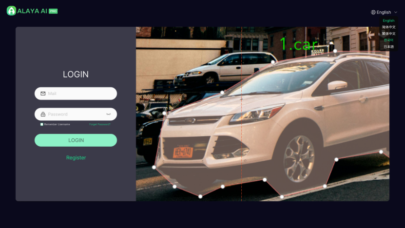
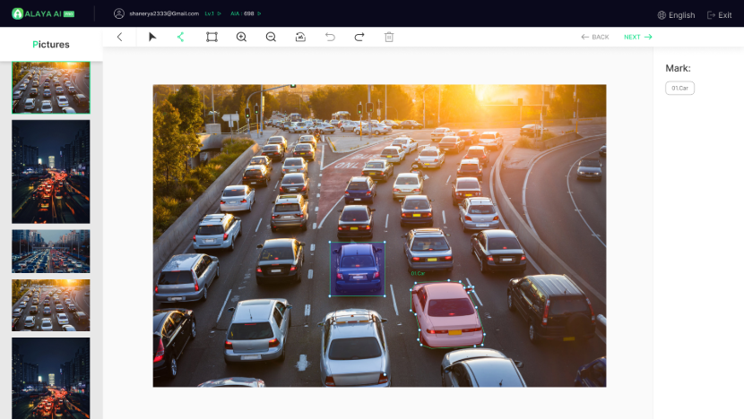
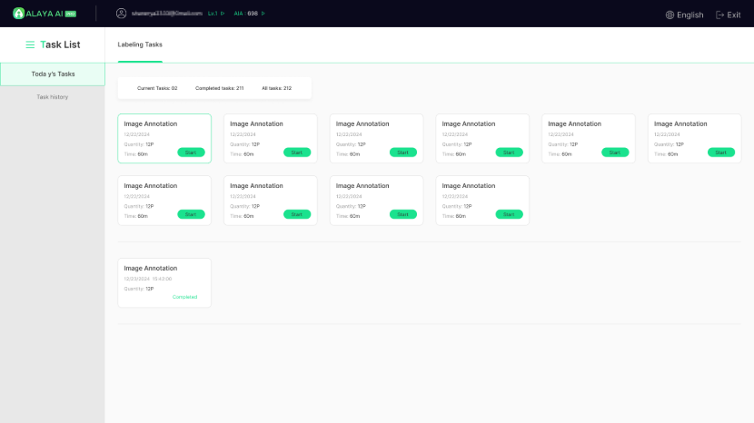

# Innovate, Integrate, Iterate — Introducing Alaya AI Pro

#### Get ready for advanced Web3-native data labelling! After months of development and testing, we are proud to announce the upcoming release of Alaya AI Pro, an advanced data labelling toolset for pixel-level image annotation and segmentation directly accessible to Web3 users.

### login view

## TLDR;

1. Alaya AI Pro is a pixel-level AI data annotation and segmentation toolset geared towards precision sampling for
     autonomous driving systems, robotics and IoT applications.
2. One of the most advanced AI data labelling toolsets currently available in Web3.
3. Initially available as a dApp with future releases for custom Web3 API and SaaS integration.

## Overview

- Designed to meet the stringent data quality standards of autonomous driving systems, sophisticated computer vision and IoT applications, Alaya AI Pro is among the most powerful data labelling toolsets currently available in the Web3 AI ecosystem.

- Alaya AI Pro provides users access to an advanced set of data labelling features to enable image annotation and segmentation at pixel-level precision. New features for Alaya AI Pro include bounding boxes, polygons, polylines and segmentation tools that are previously unavailable through the standard Alaya AI dApp.

### Data annotation view

- Due to the stricter hardware requirements of advanced, more computationally-intensive labelling processes, Alaya AI Pro will initially be released as a browser dApp optimised for PC and laptop devices. Subsequent releases are planned for mobile device support, data validation and local software applications for secure on-device data processing.

- To foster research and application of AI in Web3, a core design principle of the Alaya AI ecosystem is cross-platform interoperability. Alaya AI Pro is designed to enable plug-in architectures and direct API integration, with multi-platform API access expected to be a major project milestone for 2026 and beyond. AI developers will be able to integrate their own custom applications and utilise Alaya AI Pro’s advanced labelling toolsets, making it possible for Web3 projects to directly access custom labelling workflows and specialised annotation tools on-chain.

- The addition of Alaya AI Pro will provide the Web3 AI industry with more powerful data acquisition and optimisation channels with built-in auto-labelling and consensus validation for human-in-the-loop (HITL) labelling. This produces significant cost savings for small-medium AI developers, who would otherwise have limited access to advanced labelling tools that are typically only offered through Web2 data platforms at premium prices.

## Innovation and Application

- Unlocking additional data contribution mediums and access channels through Web3 ecosystems is a crucial part of Alaya AI’s overarching vision. Alaya AI is poised to build a “universal energy grid” for AI by enabling distributed users to freely contribute AI data with idle time, free from the physical, financial and administrative burdens of traditional data platforms.

- The Alaya AI Pro toolset shares its underlying optimisation and auto-labelling algorithms with the wider Alaya AI infrastructure for active learning integration between different interfaces. For example, auto-labelled data can be rated by mobile device users through the standard dApp and identified for further processing by Alaya AI Pro validators. Validated data can then be rated again for quality and consistency prior to utilisation for model improvement and fine-tuning. This allows Alaya AI users to freely select and arrange their activities based on availability and device access.

- To deter malicious activity, align ecosystem incentives and encourage quality data input, Alaya AI Pro users must satisfy various prerequisite conditions in order to access advanced features and high value annotation or validation tasks. Users can qualify for Alaya AI Pro through various means, such as by achieving milestones on the standard Alaya AI dApp or by passing a set of advanced labelling assessment tests.

- Consensus labelling is also enabled across the entire ecosystem for data cross-validation and auto-labelling model feedback, improving ecosystem resilience and creating positive-sum cycles where individual data contribution, even for domain-specific tasks and data niches, can drive value accrual across the wider ecosystem by improving overall platform optimisation and auto-labelling engines.

## Conclusion

The release of Alaya AI Pro marks a significant step forward for the Web3 AI industry by unlocking advanced data labelling features that are previously available only through large scale enterprise data solutions at premium prices. By making advanced pixel-level data annotation and segmentation tools directly available to distributed Web3 data communities, Alaya AI Pro significantly enhances the data labelling capability and competitiveness of the Web3 AI sector while reducing data costs across both Web2 and Web3 AI domains by maximising the utility of idle time through distributed contributor networks.